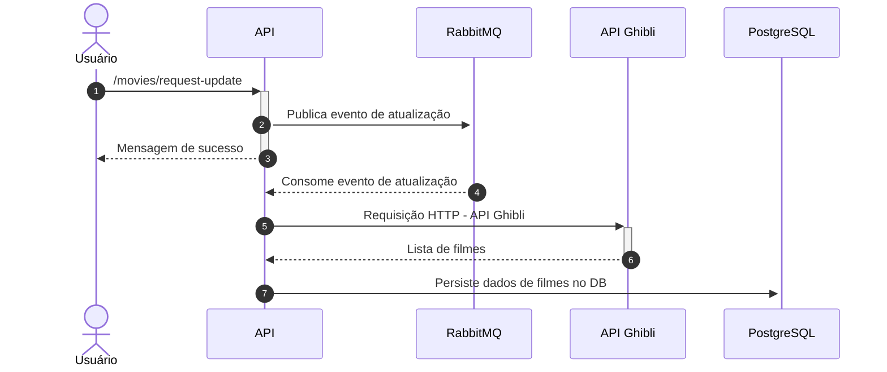

## Ghibli API - Teste técnico para a vaga de desenvolvedor sênior

Essa é uma aplicação fictícia, desenvolvida com o intuíto de demonstrar meus conhecimentos sobre engenharia de software afim de concorrer a uma vaga de desenvolvedor Node.JS sênior.


### Desafio:

O desafio solicitado pela empresa foi a criação de um serviço REST que consuma dados da API aberta do estúdio Ghibli, persistindo esses dados em um banco de dados local e depois disponibilizar a consulta a esses dados através de um Endpoint HTTP.


### Tecnologias:

- NodeJS (com TypeScript)

- PostgreSQL

- Swagger

- RabbitMQ

- Docker


### Arquitetura:

Essa API foi desenvolvida seguindos princípios modernos de engenharia de software com o objetivo de garantir o máximo desacoplamento entre as camadas e aumentar a coesão das classes e objetos.

Toda a arquitetura dessa aplicação foi baseada no padrão "Clean Architecture", seguindo diversos princípios de SOLID e Clean Code (SRP, OCP, DIP, DRY, YAGNI, KISS, etc.)

Também foram aplicados alguns Design Patterns como: Factory, Adapter, Builder, Singleton, Strategy, Dependency Injection, etc.


### Endpoints:

| URL                           | Método HTTP | Descrição                                                                                         |
| ----------------------------- | ----------- | ------------------------------------------------------------------------------------------------- |
| /docs                         | GET         | Acesso a documentação completa da API - Swagger.                                                  |
| /api/v1/movies/request-update | POST        | Realiza a inclusão de uma solicitação de atualização dos dados de filmes no banco de dados local. |
| /api/v1/movies                | GET         | Retorna a listagem de filmes presentes no banco de dados local da aplicação.                      |


### Execução em ambiente local

A execução desta aplicação depende de alguns serviços: PostgreSQL e RabbitMQ, sabendo disso preparei um arquivo "docker-compose" que deixa o ambiente pronto para executar a aplicação.

Para executar em ambiente local basta acessar a pasta raiz do projeto via terminal e rodar o seguinte instrução:

```bash
docker compose up
```

Após isso basta acessar a API através da porta 3000. 
Documentação: https://localhost:3000/docs


### Diagrama de Sequência - Solicitação de Atualização de Dados




